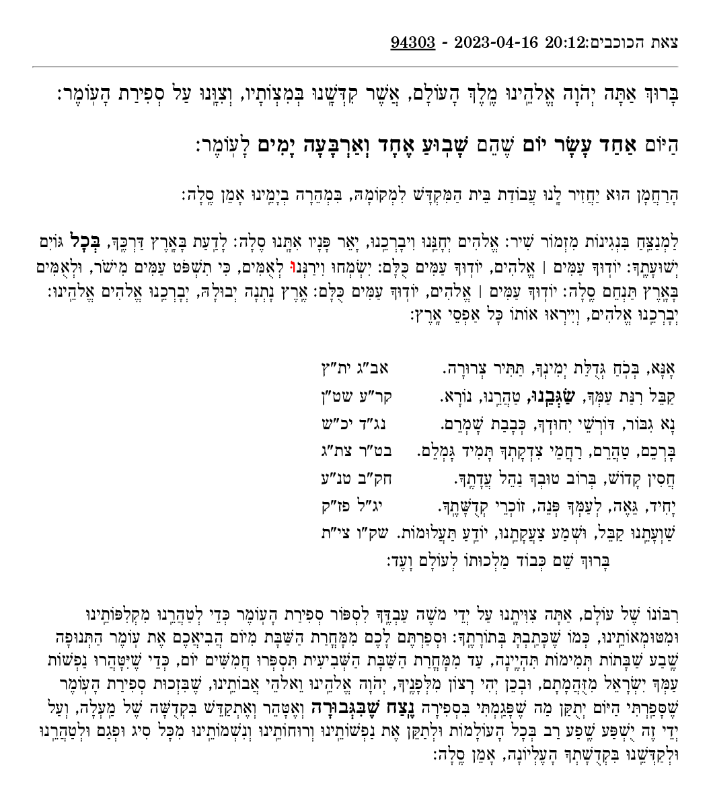

# omer

A webserver for helping Jews fulfill the mitzvah of counting the 49 days of the Omer between Pesach and Shavuos.

During the season of use, it is hosted at [yossi.pythonanywhere.com](https://yossi.pythonanywhere.com).

<!--
# After printing browser output to pdf as ../screenshot.pdf:
brew install imagemagick
convert \
    -density 150 \
    -trim +repage \
    -border 5% -bordercolor white \
    ../screenshot.pdf \
    screenshot.gif
-->


## Running locally

To setup the local environment, you will need pyenv, or a system with python 3.10 already installed. (As of 2023-04-16, python 3.11 gives errors when installing the requirements.)

```sh
# PYVER holds the latest version of python 3.10.x
PYVER=$(pyenv install -l | grep '^\s*3\.10\.' | sort -V | tail -n1)
pyenv install $PYVER
pyenv global $PYVER

python3 -m pip install --upgrade pip
pip3 install --upgrade venv
```

Then, to set up the project itself:

```sh
git clone https://github.com/yossi/omer
cd omer
python3 -m venv .venv
.venv/bin/pip3 install -r requirements.txt
echo "$(git rev-parse HEAD | head -c8)" > version.hash
```

Finally, run the Flask server:

```sh
.venv/bin/flask --app=omer run
```
